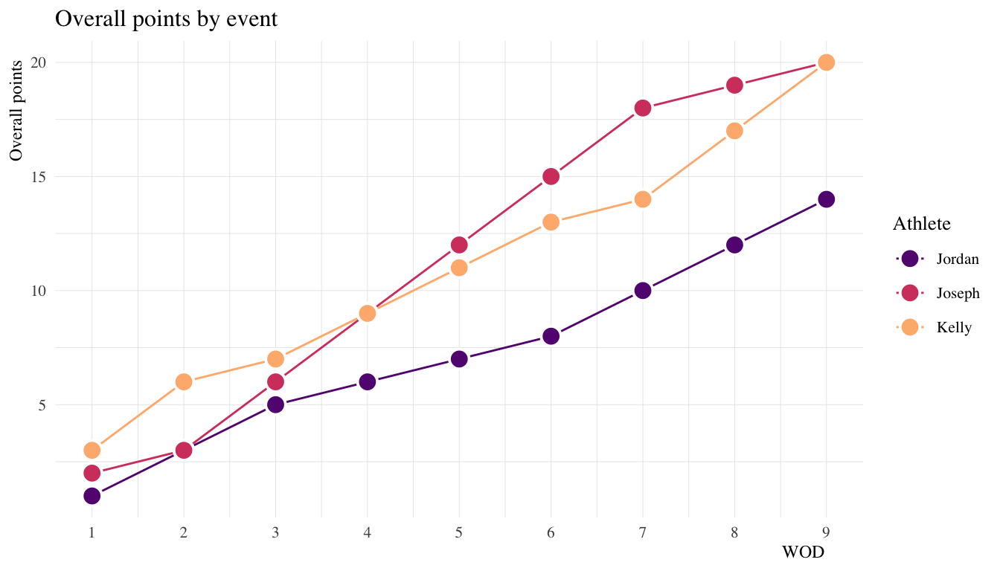
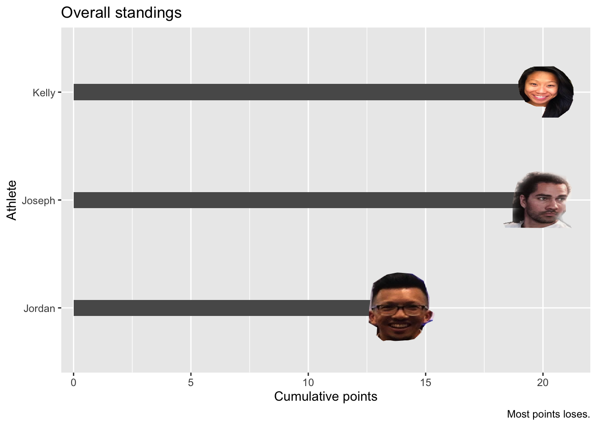
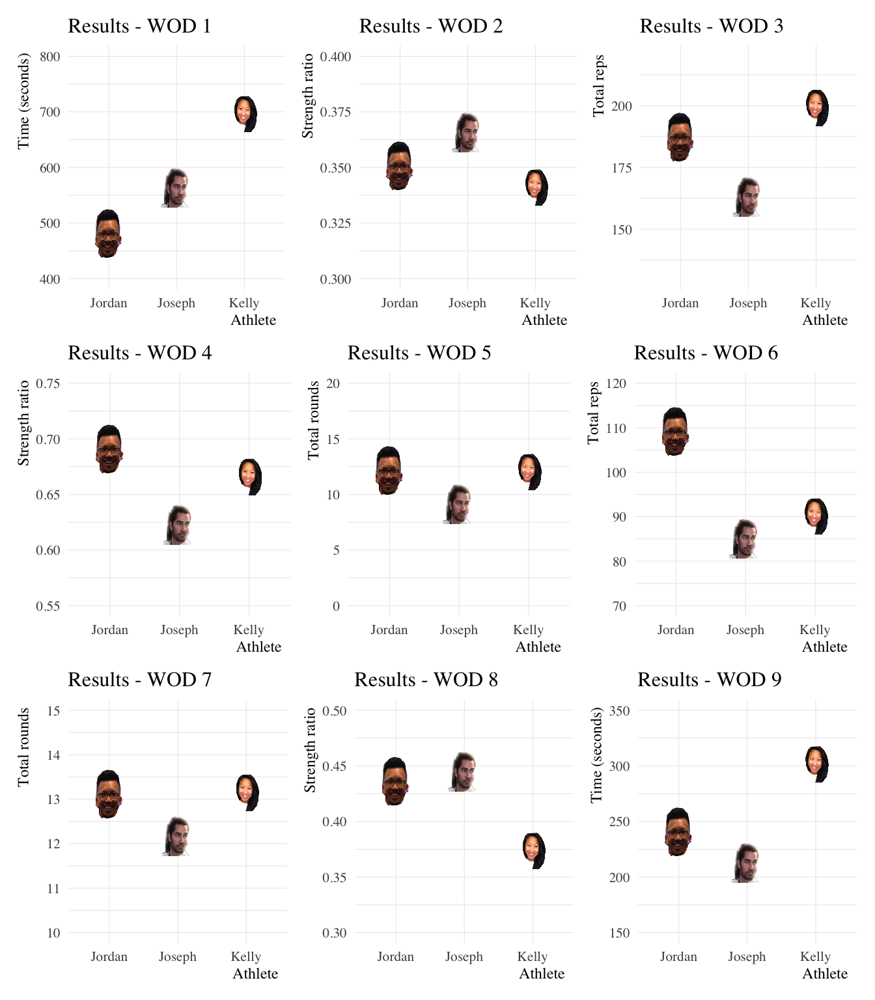
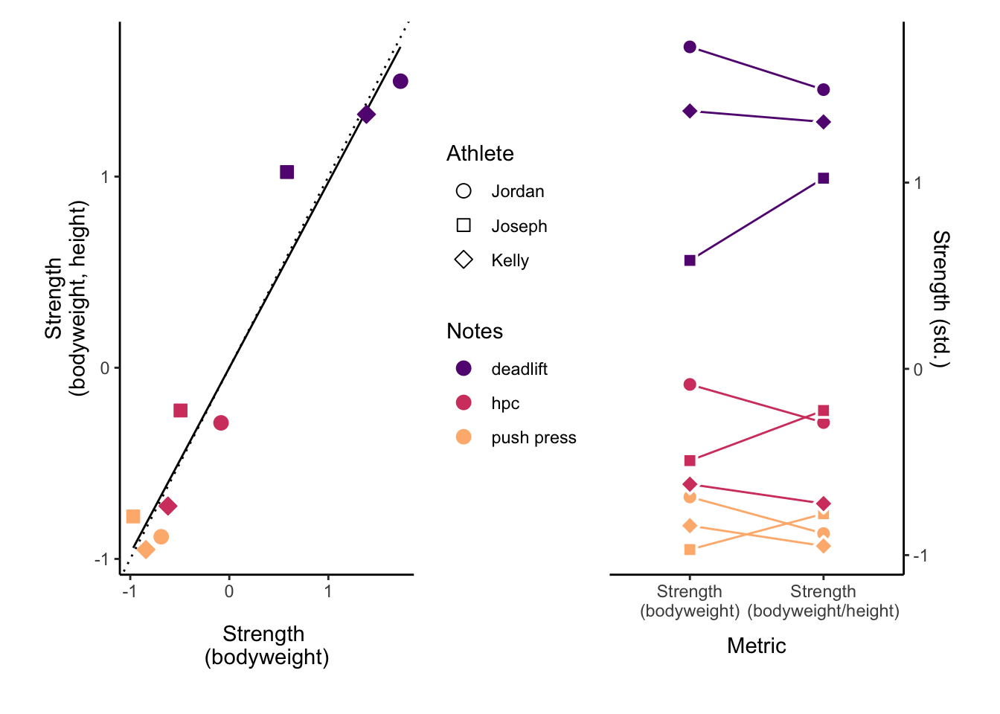

``` r
library("tidyverse")
library("lubridate")
library("ggimage")
library("patchwork")
```

``` r
wod_data <- tribble(
  ~"Athlete", ~"ht", ~"wt", ~"ss", ~"Day", ~"Event", ~"WOD",    ~"Time", ~"Reps", ~"Weight", ~"Score", ~"Notes", 
     "Kelly", 152.4,  52.3,  140,       1,        1, "metcon",   11.59,      NA,         NA,       NA,  "du, fs, row", 
    "Joseph", 190.5,  97.5,  230,       1,        1, "metcon",    9.38,      NA,         NA,       NA,  "du, fs, row", 
    "Jordan", 167.6,  77.1,  214,       1,        1, "metcon",    8.00,      NA,         NA,       NA,  "du, fs, row", 
     "Kelly", 152.4,  52.3,  140,       2,        2, "strength",    NA,      NA,        105,       NA,  "push press", 
    "Joseph", 190.5,  97.5,  230,       2,        2, "strength",    NA,      NA,        185,       NA,  "push press", 
    "Jordan", 167.6,  77.1,  214,       2,        2, "strength",    NA,      NA,        165,       NA,  "push press", 
     "Kelly", 152.4,  52.3,  140,       2,        3, "amrap",       NA,     199,         NA,       NA,  "pp, up downs", 
    "Joseph", 190.5,  97.5,  230,       2,        3, "amrap",       NA,     163,         NA,       NA,  "pp, up downs", 
    "Jordan", 167.6,  77.1,  214,       2,        3, "amrap",       NA,     187,         NA,       NA,  "pp, up downs", 
     "Kelly", 152.4,  52.3,  140,       3,        4, "strength",    NA,      NA,        205,       NA,  "deadlift", 
    "Joseph", 190.5,  97.5,  230,       3,        4, "strength",    NA,      NA,        315,       NA,  "deadlift", 
    "Jordan", 167.6,  77.1,  214,       3,        4, "strength",    NA,      NA,        325,       NA,  "deadlift", 
     "Kelly", 152.4,  52.3,  140,       3,        5, "amrap",       NA,    12.0,         NA,       NA,  "bp, dl, t2b", 
    "Joseph", 190.5,  97.5,  230,       3,        5, "amrap",       NA,    9.10,         NA,       NA,  "bp, dl, t2b", 
    "Jordan", 167.6,  77.1,  214,       3,        5, "amrap",       NA,   12.10,         NA,       NA,  "bp, dl, t2b", 
     "Kelly", 152.4,  52.3,  140,       4,        6, "amrap",       NA,      90,         NA,       NA,  "pu", 
    "Joseph", 190.5,  97.5,  230,       4,        6, "amrap",       NA,      85,         NA,       NA,  "pu", 
    "Jordan", 167.6,  77.1,  214,       4,        6, "amrap",       NA,     109,         NA,       NA,  "pu", 
     "Kelly", 152.4,  52.3,  140,       4,        7, "amrap",       NA,   13.14,         NA,       NA,  "bp, dl, t2b", 
    "Joseph", 190.5,  97.5,  230,       4,        7, "amrap",       NA,   12.16,         NA,       NA,  "bp, dl, t2b", 
    "Jordan", 167.6,  77.1,  214,       4,        7, "amrap",       NA,   13.10,         NA,       NA,  "bp, dl, t2b", 
     "Kelly", 152.4,  52.3,  140,       5,        8, "strength",    NA,      NA,        115,       NA,  "hpc", 
    "Joseph", 190.5,  97.5,  230,       5,        8, "strength",    NA,      NA,        225,       NA,  "hpc", 
    "Jordan", 167.6,  77.1,  214,       5,        8, "strength",    NA,      NA,        205,       NA,  "hpc", 
     "Kelly", 152.4,  52.3,  140,       5,        9, "metcon",    5.02,      NA,         NA,       NA,  "pc, bjo", 
    "Joseph", 190.5,  97.5,  230,       5,        9, "metcon",    3.54,      NA,         NA,       NA,  "pc, bjo", 
    "Jordan", 167.6,  77.1,  214,       5,        9, "metcon",    4.00,      NA,         NA,       NA,  "pc, bjo") 
```

``` r
standings <- wod_data %>% 
  mutate(
    image = case_when(
      Athlete == "Kelly" ~ "./image/kelly.png", 
      Athlete == "Joseph" ~ "./image/joseph.png", 
      Athlete == "Jordan" ~ "./image/jordan.png"), 
    Time = dminutes(Time), 
    Strength = Weight / (ss * 2.2), 
    St2wt =  Weight / (wt * 2.2)) %>% 
  group_by(Event) %>% 
  arrange(Time, Reps, Strength) %>% 
  mutate(Score = case_when(
    WOD == "metcon" ~ seq_along(Time), 
    WOD == "strength" ~ rev(seq_along(Strength)),
    WOD == "amrap" ~ rev(seq_along(Reps))
  )) %>% 
  ungroup() %>% 
  arrange(Athlete, Day, Event)
```

``` r
# Calculate final rankings
overall <- standings %>% 
  group_by(Athlete, image) %>% 
  summarize(Overall = sum(Score), .groups = "drop")

# Cumulative scores by event
overall_events <- standings %>% 
  group_by(Athlete, image) %>% 
  summarize(Overall = cumsum(Score), .groups = "drop") %>% 
  group_by(Athlete) %>% 
  mutate(Event = seq_along(Athlete)) %>% 
  ungroup() %>% 
  mutate(Score = standings$Score) %>% 
  select(Athlete, Event, Score, Overall, image)
```

``` r
overall_events %>% 
  select(-image) %>% 
  pivot_wider(id_cols = c("Athlete"), names_from = Event, values_from = Score) %>% 
  rowwise() %>% 
  mutate(Overall = sum(c_across(`1`:`9`))) %>% 
  knitr::kable(format = "pandoc")
```

| Athlete | 1 | 2 | 3 | 4 | 5 | 6 | 7 | 8 | 9 | Overall |
| :------ | -: | -: | -: | -: | -: | -: | -: | -: | -: | ------: |
| Jordan  | 1 | 2 | 2 | 1 | 1 | 1 | 2 | 2 | 2 |      14 |
| Joseph  | 2 | 1 | 3 | 3 | 3 | 3 | 3 | 1 | 1 |      20 |
| Kelly   | 3 | 3 | 1 | 2 | 2 | 2 | 1 | 3 | 3 |      20 |

``` r
# Plot standings by events
overall_events %>% 
  ggplot(., aes(x = Event, y = Overall, color = Athlete)) + 
    geom_point() + 
    geom_path(aes(group = Athlete)) + 
    scale_x_continuous(breaks = seq(1, max(standings$Event), 1)) + 
    labs(y = "Overall points", x = "WOD", title = "Overall points by event")
```



``` r
overall_events %>% 
  ggplot(., aes(x = Event, y = Score, color = Athlete)) + 
  geom_point() + 
  geom_path(aes(group = Athlete)) + 
  scale_x_continuous(breaks = seq(1, max(standings$Event), 1)) + 
  labs(y = "Overall points", x = "WOD", title = "Overall points by event")
```

``` r
# Plot Podium
overall %>% 
  ggplot(., aes(x = Overall, y = Athlete)) + 
    geom_bar(stat = "identity", width = 0.15) + 
    geom_point() + 
    geom_image(aes(image = image), size = .15) + 
    coord_cartesian(xlim = c(0.5, max(overall$Overall) + 1)) + 
    labs(title = "Overall standings", caption = "Most points loses.", 
         x = "Cumulative points")
```



``` r
# Events

# WOD 1
w1 <- standings %>% 
  filter(Event == 1) %>% 
  ggplot(., aes(x = Athlete, y = Time)) + 
    geom_point() + 
    geom_image(aes(image = image), size = .15) + 
    coord_cartesian(ylim = c(400, 800)) + 
    labs(title = "Results - WOD 1", y = "Time (seconds)")

# WOD 2
w2 <- standings %>% 
  filter(Event == 2) %>% 
  ggplot(., aes(x = Athlete, y = Strength)) + 
    geom_point() + 
    geom_image(aes(image = image), size = .15) + 
    coord_cartesian(ylim = c(0.3, 0.4)) + 
    labs(title = "Results - WOD 2", y = "Strength ratio")

# WOD 3
w3 <- standings %>% 
  filter(Event == 3) %>% 
  ggplot(., aes(x = Athlete, y = Reps)) + 
    geom_point() + 
    geom_image(aes(image = image), size = .15) + 
    coord_cartesian(ylim = c(130, 220)) + 
    labs(title = "Results - WOD 3", y = "Total reps")

# WOD 4
w4 <- standings %>% 
  filter(Event == 4) %>% 
  ggplot(., aes(x = Athlete, y = Strength)) + 
    geom_point() + 
    geom_image(aes(image = image), size = .15) + 
    coord_cartesian(ylim = c(0.55, 0.75)) + 
    labs(title = "Results - WOD 4", y = "Strength ratio")

# WOD 5
w5 <- standings %>% 
  filter(Event == 5) %>% 
  ggplot(., aes(x = Athlete, y = Reps)) + 
    geom_point() + 
    geom_image(aes(image = image), size = .15) + 
    coord_cartesian(ylim = c(0, 20)) + 
    labs(title = "Results - WOD 5", y = "Total rounds")

# WOD 6
w6 <- standings %>% 
  filter(Event == 6) %>% 
  ggplot(., aes(x = Athlete, y = Reps)) + 
    geom_point() + 
    geom_image(aes(image = image), size = .15) + 
    coord_cartesian(ylim = c(70, 120)) + 
    labs(title = "Results - WOD 6", y = "Total reps")

# WOD 7
w7 <- standings %>% 
  filter(Event == 7) %>% 
  ggplot(., aes(x = Athlete, y = Reps)) + 
    geom_point() + 
    geom_image(aes(image = image), size = .15) + 
    coord_cartesian(ylim = c(10, 15)) + 
    labs(title = "Results - WOD 7", y = "Total rounds")

# WOD 8
w8 <- standings %>% 
  filter(Event == 8) %>% 
  ggplot(., aes(x = Athlete, y = Strength)) + 
    geom_point() + 
    geom_image(aes(image = image), size = .15) + 
    coord_cartesian(ylim = c(0.3, 0.50)) + 
    labs(title = "Results - WOD 8", y = "Strength ratio")

# WOD 9
w9 <- standings %>% 
  filter(Event == 9) %>% 
  ggplot(., aes(x = Athlete, y = Time)) + 
    geom_point() + 
    geom_image(aes(image = image), size = .15) + 
    coord_cartesian(ylim = c(150, 350)) + 
    labs(title = "Results - WOD 9", y = "Time (seconds)")


(w1 | w2 | w3) / (w4 | w5 | w6) / (w7 | w8 | w9)
```



## Strength ratio information

<https://www.strongerbyscience.com/objective-strength-standards/>

``` r
wt_plot_1 <- standings %>% 
  filter(WOD == "strength") %>% 
  mutate(Event = as.factor(Event), 
         St2wt = scale(St2wt), 
         Strength = scale(Strength)) %>% 
  ggplot() +  
  aes(x = St2wt, y = Strength) + 
    geom_abline(intercept = 0, slope = 1, lty = 3) + 
    geom_smooth(method = lm, se = F, color = "black", size = 0.5) +
    geom_point(aes(fill = Notes, color = Notes, shape = Athlete), size = 3) + 
    scale_fill_viridis_d(option = "A", begin = 0.3, end = 0.85) + 
    scale_color_viridis_d(option = "A", begin = 0.3, end = 0.85) + 
    scale_shape_manual(values = 21:23) + 
    labs(y = "\nStrength\n(bodyweight, height)", x = "Strength \n(bodyweight)\n") + 
    theme_classic()  

wt_plot_2 <- standings %>% 
  filter(WOD == "strength") %>% 
  select(Athlete, Event, Strength, St2wt, Notes) %>% 
  pivot_longer(cols = c("Strength", "St2wt"), 
    names_to = "metric", values_to = "val") %>% 
  mutate(Event = as.factor(Event)) %>% 
  group_by(metric) %>% 
  mutate(val_std = scale(val)) %>% 
  ggplot() + 
  aes(x = metric, y = val_std, shape = Athlete, 
    group = interaction(Athlete, Notes)) + 
    geom_line(aes(color = Notes), show.legend = F) + 
    geom_point(aes(fill = Notes), color = "white", size = 3, stroke = 1, 
      show.legend = F) + 
    scale_y_continuous(position = "right") + 
    scale_x_discrete(
      labels = c("Strength\n(bodyweight)", "Strength\n(bodyweight/height)")) + 
    scale_shape_manual(values = 21:23) + 
    scale_fill_viridis_d(option = "A", begin = 0.3, end = 0.85) + 
    scale_color_viridis_d(option = "A", begin = 0.3, end = 0.85) + 
    labs(y = "\nStrength (std.)", x = "Metric\n") + 
    theme_classic()

wt_plot_1 + wt_plot_2
```


