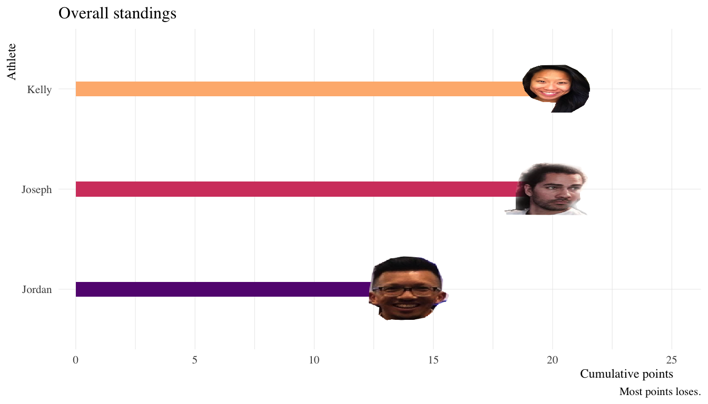
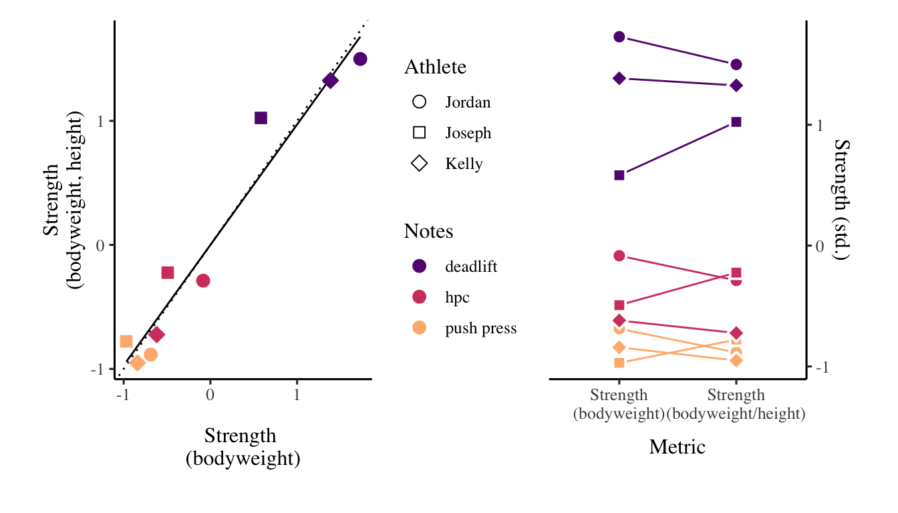

| Athlete | WOD1 | WOD2 | WOD3 | WOD4 | WOD5 | WOD6 | WOD7 | WOD8 | WOD9 | Overall |
| :------ | ---: | ---: | ---: | ---: | ---: | ---: | ---: | ---: | ---: | ------: |
| Jordan  |    1 |    2 |    2 |    1 |    1 |    1 |    2 |    2 |    2 |      14 |
| Joseph  |    2 |    1 |    3 |    3 |    3 |    3 |    3 |    1 |    1 |      20 |
| Kelly   |    3 |    3 |    1 |    2 |    2 |    2 |    1 |    3 |    3 |      20 |

## Strength ratio information

<https://www.strongerbyscience.com/objective-strength-standards/>

